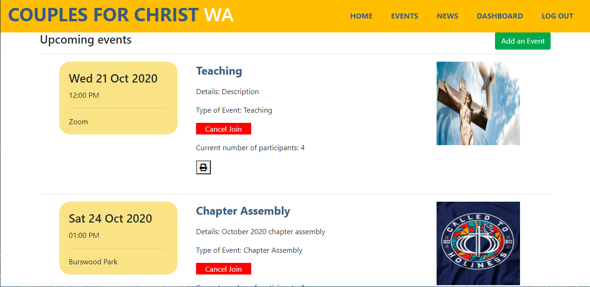
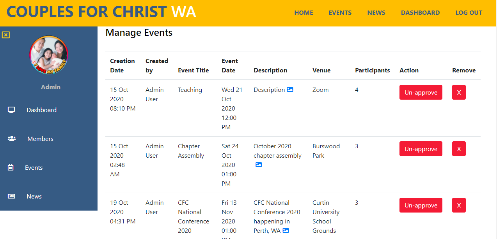

# Couples for Christ Western Australia Website

## Description: 
Welcome to my Final Project for the UWA Full Stack Bootcamp course!
This is a modernisation of the website for the community I belong to, Couples for Christ Western Australia, using a full-stack MERN application.
The site can be previewed here: https://couples-for-christ-wa.herokuapp.com/ .
An admin account has been created that has access to all features. Please email me to get the login credentials.

## Table of Contents 
* [Installation](#Installation) 
* [Usage Information](#Usage) 
* [Contributing](#Contributing) 
* [Test Instructions](#Tests) 
* [Questions](#Questions) 
* [License](#License)  

## Installation: 
1. Clone the project files.
2. Install NODE.js on your machine. Find the latest version on https://nodejs.org/en/
3. Open Git Bash or any Command Line tool and type in "NPM INSTALL". 
4. Install MONGO DB and run the MONGO DB service on your machine.

Note: The config "SERVER.JS" file handles the connections in the Heroku environment. The project preview uses the MONGODB_URI config variable to connect to the author's Mongo DB cluster.

## Usage: 

These are the pages to the website:

The landing page:

The upcoming events page:

The dashboard for an admin who manages users, events and news in the website:

## Contributing: 
This is a personal repository. Pull requests are not allowed unless you are a member of Couples for Christ.

## Tests: 
No tests have been implemented yet.
 
## Questions: 
Please visit my [GitHub Page](https://github.com/ong-osmond/) or email me your questions at ong.osmond@yahoo.com. 
I am available 8am-4pm Monday-Friday (Australian Western Standard Time). 

## License: 
MIT License

Copyright (c) 2020 Osmond Ong

Permission is hereby granted, free of charge, to any person obtaining a copy
of this software and associated documentation files (the "Software"), to deal
in the Software without restriction, including without limitation the rights
to use, copy, modify, merge, publish, distribute, sublicense, and/or sell
copies of the Software, and to permit persons to whom the Software is
furnished to do so, subject to the following conditions:

The above copyright notice and this permission notice shall be included in all
copies or substantial portions of the Software.

THE SOFTWARE IS PROVIDED "AS IS", WITHOUT WARRANTY OF ANY KIND, EXPRESS OR
IMPLIED, INCLUDING BUT NOT LIMITED TO THE WARRANTIES OF MERCHANTABILITY,
FITNESS FOR A PARTICULAR PURPOSE AND NONINFRINGEMENT. IN NO EVENT SHALL THE
AUTHORS OR COPYRIGHT HOLDERS BE LIABLE FOR ANY CLAIM, DAMAGES OR OTHER
LIABILITY, WHETHER IN AN ACTION OF CONTRACT, TORT OR OTHERWISE, ARISING FROM,
OUT OF OR IN CONNECTION WITH THE SOFTWARE OR THE USE OR OTHER DEALINGS IN THE
SOFTWARE.
